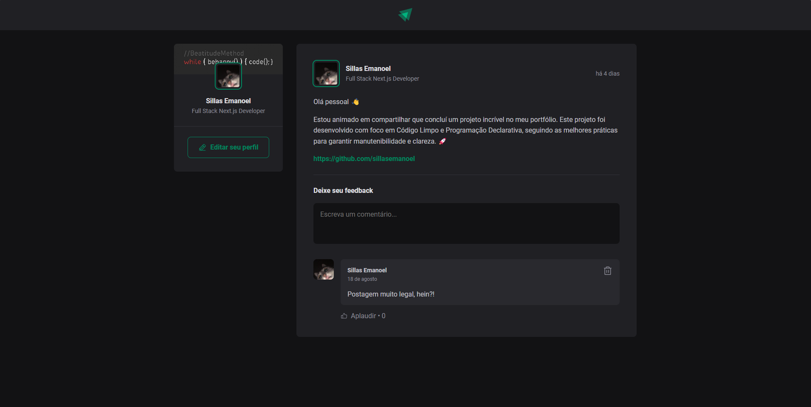

<h1 align="center">
    
</h1>
<p align="center">Ignite Feed. Um aplicativo de feed onde você pode visualizar perfis, postagens, comentários, interagir com eles e muito mais.</p>
<p align="center">
 <a href="#sobre-o-projeto">Sobre o Projeto</a> |
 <a href="#tecnologias">Tecnologias</a> |
 <a href="#iniciando-o-projeto">Iniciando o projeto</a> |
 <a href="#licença">Licença</a> |
 <a href="#autor">Autor</a> 
</p>

### Sobre o Projeto

Ignite Feed é um aplicativo projetado para exibir perfis de usuários, suas postagens e comentários. Com recursos interativos, como comentar, aplaudir e visualizar horários de postagens, este app tem como objetivo proporcionar uma experiência rica e dinâmica para os usuários.

- [x] Exibir perfil do usuário
- [x] Visualizar e interagir com postagens
- [x] Comentar nas postagens
- [x] Aplaudir postagens
- [x] Ver horário da postagem

---

### Tecnologias

- [ReactJs](https://reactjs.org/) - Biblioteca JavaScript para construir interfaces de usuário
- [JavaScript](https://developer.mozilla.org/pt-BR/docs/Web/JavaScript) - Linguagem de programação
- [Vite](https://vitejs.dev/) - Ferramenta de build
- [ESLint](https://eslint.org/) - Linter para código JavaScript e TypeScript
- [@phosphor-icons/react](https://phosphoricons.com/) - Biblioteca de ícones
- [date-fns](https://date-fns.org/) - Utilitário para manipulação de datas

---

### Como Começar

```bash
# Clone o aplicativo
$ git clone https://github.com/sillasemanoel/ignite-feed-js

# Navegue até o diretório do aplicativo
$ cd ignite-feed-js

# Instale as dependências
$ npm i

# Para iniciar o aplicativo
$ npm run dev
```

---

### Licença

Distribuído sob a Licença MIT. Veja [LICENSE](LICENSE) para mais informações.

---

### Autor

Feito por Sillas Emanoel 👋🏽
